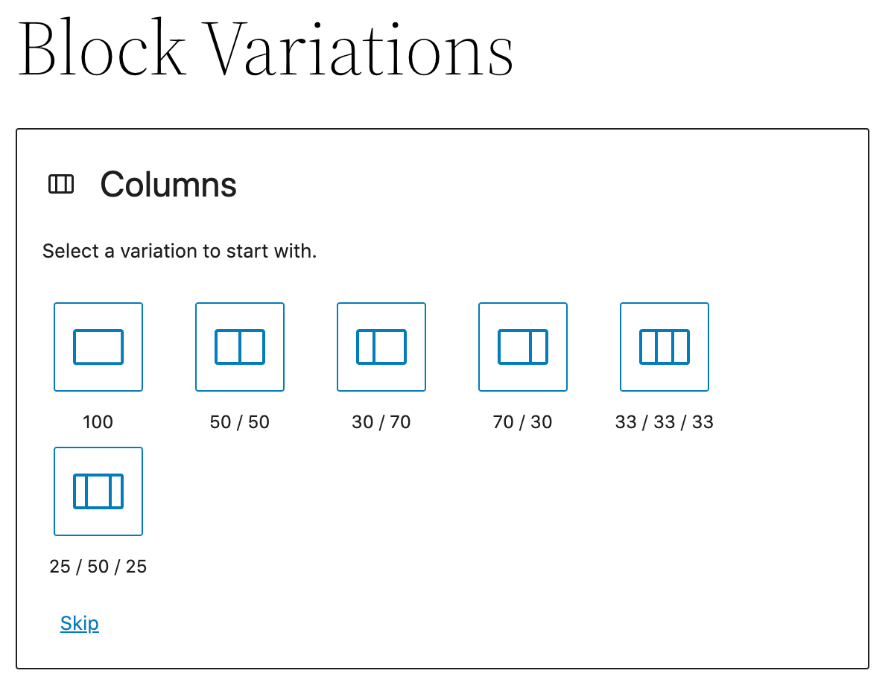

# Block Variations

We can set a block variation to get an initial state of a block (including the attributes or inner blocks). These can display both as unique blocks or in the block options via scope property. 

Block Variations is the API that allows a block to have similar versions of it, but all these versions share some common functionality. Each block variation is differentiated from the others by setting some initial attributes or inner blocks. Then at the time when a block is inserted these attributes and/or inner blocks are applied. The main difference between block styles and block variations is that a block style just applies a CSS class to the block, so it can be styled in an alternative way. If we want to apply initial attributes or inner blocks, we fall in block variation territory. We can scope the variation to be in the inserter and/or as a variation of the block only. 

## Example
An example of a block variation in core is the columns block - the preset options you can choose are variations. The column variations are not available in the inserter but in the columns block option as a `blockVariationPicker`. We can also have the variation scoped to transforms

You can choose though to have the variations displayed with the main block which it is associated with but you can also make it stand alone and appear as a unique block. A use case for this is when you have a block with various settings that a user may want to jump into immediately. Also can use this to create a new block which is only a collection of exisitng blocks. 

### Further Reading
- https://developer.wordpress.org/block-editor/reference-guides/block-api/block-variations/ 
- https://github.com/WordPress/gutenberg/blob/trunk/packages/block-library/src/columns/variations.js
### Contents
- [Overview](01-overview.md)
- [Block Vision](02-block-vision.md)
- [Block Basics](03-block-basics.md)
- [Block Markup](04-block-markup.md)
- [Core Blocks](05-core-blocks.md)
- [Custom Blocks](06-custom-blocks.md)
- [Dynamic Blocks](07-dynamic-blocks.md)
- [Block Styles](08-block-styles.md)
- [Reusable Blocks](09-reusable-blocks.md)
- [InnerBlocks](10-innerblocks.md)
- ***Block Variations***
- [Block Transforms](12-block-transforms.md)
- [Block Supports](13-block-supports.md)
- [Widget Blocks](14-widget-blocks.md)
- [Block Patterns](15-block-patterns.md)
- [Block Template](16-block-template.md)
- [Block-Based Themes](17-block-based-themes.md)
- [Block Templates](18-block-templates.md)
- [Block Template Parts](19-block-template-parts.md)
- [Blocks Deeply](20-blocks-deeply.md)