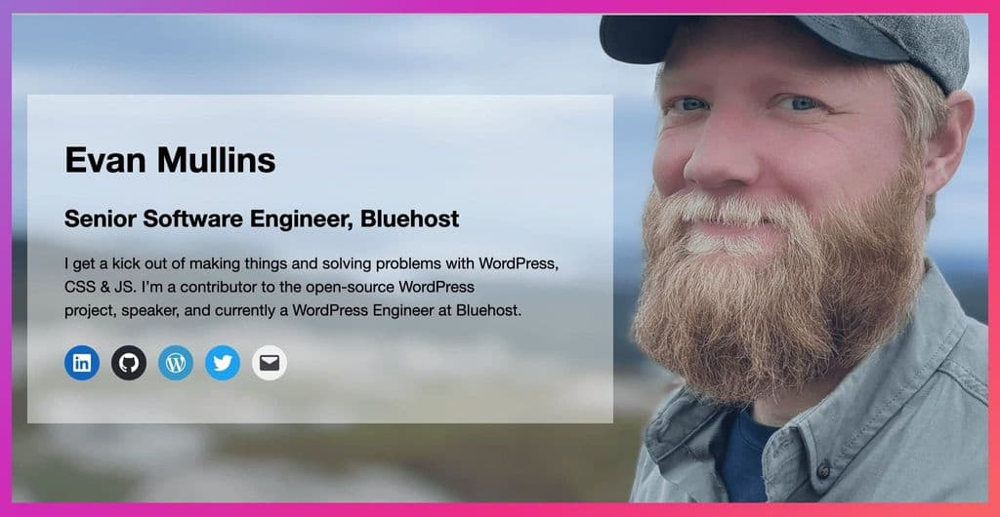

## Business Card Block Pattern
Block pattern to resemble a business card. Meant for a quick easy setup for a personal site. Create a site, make a single page template your home page and add this block pattern. Done.

### Block description
Cover block with a background image. With a group block containing a header and paragraph and social links.



### Block markup
```
<!-- wp:cover {"url":"....jpg","id":8026,"dimRatio":20,"overlayColor":"dark-cyan-blue","minHeight":500,"isDark":false,"align":"wide","style":{"spacing":{"padding":{"right":"24rem"}}}} -->
<div class="wp-block-cover alignwide is-light" style="padding-right:24rem;min-height:500px"><span aria-hidden="true" class="wp-block-cover__background has-dark-cyan-blue-background-color has-background-dim-20 has-background-dim"></span><div class="wp-block-cover__inner-container"><!-- wp:group {"style":{"color":{"background":"#ffffff78"}},"layout":{"type":"default"}} -->
<div class="wp-block-group has-background" style="background-color:#ffffff78"><!-- wp:heading {"level":1,"fontSize":"large"} -->
<h1 class="has-large-font-size">Evan Mullins</h1>
<!-- /wp:heading -->

<!-- wp:heading -->
<h2>Senior Software Engineer, Bluehost</h2>
<!-- /wp:heading -->

<!-- wp:paragraph -->
<p>I get a kick out of making things and solving problems with WordPress, CSS & JS. I’m a contributor to the open-source WordPress project, speaker, and currently a WordPress Engineer at Bluehost.</p>
<!-- /wp:paragraph -->

<!-- wp:social-links -->
<ul class="wp-block-social-links"><!-- wp:social-link {"url":"https://linkedin.com/in/evanmullins","service":"linkedin"} /-->

<!-- wp:social-link {"url":"https://github.com/circlecube","service":"github"} /-->

<!-- wp:social-link {"url":"https://profiles.wordpress.org/users/circlecube/","service":"wordpress"} /-->

<!-- wp:social-link {"url":"https://twitter.com/circlecube","service":"twitter"} /-->

<!-- wp:social-link {"url":"spam@example.com","service":"mail"} /--></ul>
<!-- /wp:social-links --></div>
<!-- /wp:group --></div></div>
<!-- /wp:cover -->
```

### Block example
https://evanmullins.com/business-card/

### Contents
- [Overview](overview.md)
- [The Case For A Personal Site](case-for-personal-site.md)
- [Helpful Blocks For A Personal Site](helpful-blocks.md)
 - ***Business Card***
 - [Cover](cover-block.md)
 - [LinkTree](linktree-block.md)
 - [Social Links](social-links-block.md)
 - [Resume Experience](resume-experience-job-block.md)
 - [Resume Skills](resume-skills-block.md)
 - [Talk](talk-block.md)
- [Get Inspired](insipration.md)
- [Thanks!](thanks.md)