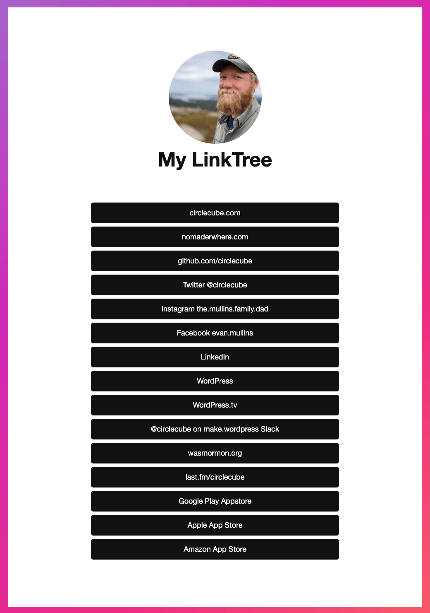

## LinkTree Block Pattern
This block pattern is modeled after the popular linktree design pattern where social users can only share a single link in their bio. They will create a page containing all their links and point people to that page. If you want a personal site but use social media primarily, this could be a nice block to showcase on or even as your site.

See link in bio.

### Block details
Cover block with background containing a rounded square image (optional), followed by a  spacer and buttons.



### Block markup
```
<!-- wp:cover {"dimRatio":0,"gradient":"cool-to-warm-spectrum","isDark":false,"align":"full"} -->
<div class="wp-block-cover alignfull is-light"><span aria-hidden="true" class="wp-block-cover__background has-background-dim-0 has-background-dim has-background-gradient has-cool-to-warm-spectrum-gradient-background"></span><div class="wp-block-cover__inner-container"><!-- wp:group {"layout":{"inherit":false,"contentSize":"600px"}} -->
<div class="wp-block-group"><!-- wp:group {"layout":{"type":"flex","orientation":"vertical","justifyContent":"center"}} -->
<div class="wp-block-group"><!-- wp:spacer {"height":"80px"} -->
<div style="height:80px" aria-hidden="true" class="wp-block-spacer"></div>
<!-- /wp:spacer -->

<!-- wp:image {"align":"center","id":8043,"width":225,"height":225,"sizeSlug":"medium","linkDestination":"none","style":{"border":{"radius":"100rem"}},"className":"is-style-default"} -->
<figure class="wp-block-image aligncenter size-medium is-resized is-style-default" style="border-radius:100rem"></figure>
<!-- /wp:image -->

<!-- wp:heading {"textAlign":"center","style":{"typography":{"fontSize":"48px"},"color":{"text":"#111111"}}} -->
<h2 class="has-text-align-center has-text-color" style="color:#111111;font-size:48px"><strong>My LinkTree</strong></h2>
<!-- /wp:heading -->

<!-- wp:spacer {"height":"60px"} -->
<div style="height:60px" aria-hidden="true" class="wp-block-spacer"></div>
<!-- /wp:spacer -->

<!-- wp:buttons {"layout":{"type":"flex","justifyContent":"center","orientation":"horizontal"}} -->
<div class="wp-block-buttons"><!-- wp:button {"width":100,"style":{"color":{"background":"#111111","text":"#fefefe"},"border":{"radius":"6px"}}} -->
<div class="wp-block-button has-custom-width wp-block-button__width-100"><a class="wp-block-button__link has-text-color has-background" href="https://circlecube.com" style="border-radius:6px;background-color:#111111;color:#fefefe" target="_blank" rel="noreferrer noopener">circlecube.com</a></div>
<!-- /wp:button -->

<!-- wp:button {"width":100,"style":{"color":{"background":"#111111","text":"#fefefe"},"border":{"radius":"6px"}}} -->
<div class="wp-block-button has-custom-width wp-block-button__width-100"><a class="wp-block-button__link has-text-color has-background" href="https://nomaderwhere.com" style="border-radius:6px;background-color:#111111;color:#fefefe" target="_blank" rel="noreferrer noopener">nomaderwhere.com</a></div>
<!-- /wp:button -->

<!-- wp:button {"width":100,"style":{"color":{"background":"#111111","text":"#fefefe"},"border":{"radius":"6px"}}} -->
<div class="wp-block-button has-custom-width wp-block-button__width-100"><a class="wp-block-button__link has-text-color has-background" href="https://github.com/circlecube" style="border-radius:6px;background-color:#111111;color:#fefefe" target="_blank" rel="noreferrer noopener">github.com/circlecube</a></div>
<!-- /wp:button -->

<!-- wp:button {"width":100,"style":{"color":{"background":"#111111","text":"#fefefe"},"border":{"radius":"6px"}}} -->
<div class="wp-block-button has-custom-width wp-block-button__width-100"><a class="wp-block-button__link has-text-color has-background" href="https://twitter.com/circlecube" style="border-radius:6px;background-color:#111111;color:#fefefe">Twitter @circlecube</a></div>
<!-- /wp:button -->

<!-- wp:button {"width":100,"style":{"color":{"background":"#111111","text":"#fefefe"},"border":{"radius":"6px"}}} -->
<div class="wp-block-button has-custom-width wp-block-button__width-100"><a class="wp-block-button__link has-text-color has-background" href="https://www.instagram.com/the.mullins.family.dad/" style="border-radius:6px;background-color:#111111;color:#fefefe" target="_blank" rel="noreferrer noopener">Instagram the.mullins.family.dad</a></div>
<!-- /wp:button -->

<!-- wp:button {"width":100,"style":{"color":{"background":"#111111","text":"#fefefe"},"border":{"radius":"6px"}}} -->
<div class="wp-block-button has-custom-width wp-block-button__width-100"><a class="wp-block-button__link has-text-color has-background" href="https://facebook.com/evan.mullins" style="border-radius:6px;background-color:#111111;color:#fefefe">Facebook evan.mullins</a></div>
<!-- /wp:button -->

<!-- wp:button {"width":100,"style":{"color":{"background":"#111111","text":"#fefefe"},"border":{"radius":"6px"}}} -->
<div class="wp-block-button has-custom-width wp-block-button__width-100"><a class="wp-block-button__link has-text-color has-background" href="https://linkedin.com/in/evanmullins" style="border-radius:6px;background-color:#111111;color:#fefefe">LinkedIn</a></div>
<!-- /wp:button -->

<!-- wp:button {"width":100,"style":{"color":{"background":"#111111","text":"#fefefe"},"border":{"radius":"6px"}}} -->
<div class="wp-block-button has-custom-width wp-block-button__width-100"><a class="wp-block-button__link has-text-color has-background" href="https://profiles.wordpress.org/users/circlecube/" style="border-radius:6px;background-color:#111111;color:#fefefe">WordPress</a></div>
<!-- /wp:button -->

<!-- wp:button {"width":100,"style":{"color":{"background":"#111111","text":"#fefefe"},"border":{"radius":"6px"}}} -->
<div class="wp-block-button has-custom-width wp-block-button__width-100"><a class="wp-block-button__link has-text-color has-background" href="https://wordpress.tv/speakers/evan-mullins/" style="border-radius:6px;background-color:#111111;color:#fefefe">WordPress.tv</a></div>
<!-- /wp:button -->

<!-- wp:button {"width":100,"style":{"color":{"background":"#111111","text":"#fefefe"},"border":{"radius":"6px"}}} -->
<div class="wp-block-button has-custom-width wp-block-button__width-100"><a class="wp-block-button__link has-text-color has-background" href="https://app.slack.com/client/T024MFP4J/D1KM6HX8W/user_profile/U02S4LRKA" style="border-radius:6px;background-color:#111111;color:#fefefe">@circlecube on make.wordpress Slack</a></div>
<!-- /wp:button -->

<!-- wp:button {"width":100,"style":{"color":{"background":"#111111","text":"#fefefe"},"border":{"radius":"6px"}}} -->
<div class="wp-block-button has-custom-width wp-block-button__width-100"><a class="wp-block-button__link has-text-color has-background" href="https://wasmormon.org/profile/evan.mullins" style="border-radius:6px;background-color:#111111;color:#fefefe">wasmormon.org</a></div>
<!-- /wp:button -->

<!-- wp:button {"width":100,"style":{"color":{"background":"#111111","text":"#fefefe"},"border":{"radius":"6px"}}} -->
<div class="wp-block-button has-custom-width wp-block-button__width-100"><a class="wp-block-button__link has-text-color has-background" href="https://last.fm/user/circlecube" style="border-radius:6px;background-color:#111111;color:#fefefe" target="_blank" rel="noreferrer noopener">last.fm/circlecube</a></div>
<!-- /wp:button -->

<!-- wp:button {"width":100,"style":{"color":{"background":"#111111","text":"#fefefe"},"border":{"radius":"6px"}}} -->
<div class="wp-block-button has-custom-width wp-block-button__width-100"><a class="wp-block-button__link has-text-color has-background" href="https://play.google.com/store/apps/developer?id=Evan+Mullins" style="border-radius:6px;background-color:#111111;color:#fefefe" target="_blank" rel="noreferrer noopener">Google Play Appstore</a></div>
<!-- /wp:button -->

<!-- wp:button {"width":100,"style":{"color":{"background":"#111111","text":"#fefefe"},"border":{"radius":"6px"}}} -->
<div class="wp-block-button has-custom-width wp-block-button__width-100"><a class="wp-block-button__link has-text-color has-background" href="https://itunes.apple.com/us/artist/evan-mullins/id971859233" style="border-radius:6px;background-color:#111111;color:#fefefe" target="_blank" rel="noreferrer noopener">Apple App Store</a></div>
<!-- /wp:button -->

<!-- wp:button {"width":100,"style":{"color":{"background":"#111111","text":"#fefefe"},"border":{"radius":"6px"}}} -->
<div class="wp-block-button has-custom-width wp-block-button__width-100"><a class="wp-block-button__link has-text-color has-background" href="https://www.amazon.com/s?rh=n%3A2350149011%2Cp_4%3AEvan+Mullins&amp;_encoding=UTF8&amp;ref=bl_sr_mobile-apps" style="border-radius:6px;background-color:#111111;color:#fefefe">Amazon App Store</a></div>
<!-- /wp:button --></div>
<!-- /wp:buttons -->

<!-- wp:spacer {"height":"90px"} -->
<div style="height:90px" aria-hidden="true" class="wp-block-spacer"></div>
<!-- /wp:spacer --></div>
<!-- /wp:group --></div>
<!-- /wp:group --></div></div>
<!-- /wp:cover -->
```

### Block example
https://wordpress.org/patterns/pattern/linktree/
https://evanmullins.com/linktree/

### Contents
- [Overview](overview.md)
- [The Case For A Personal Site](case-for-personal-site.md)
- [Helpful Blocks For A Personal Site](helpful-blocks.md)
 - [Cover](cover-block.md)
 - [Business Card](business-card-block.md)
 - ***LinkTree***
 - [Social Links](social-links-block.md)
 - [Resume Experience](resume-experience-job-block.md)
 - [Resume Skills](resume-skills-block.md)
 - [Talk](talk-block.md)
- [Get Inspired](insipration.md)
- [Thanks!](thanks.md)