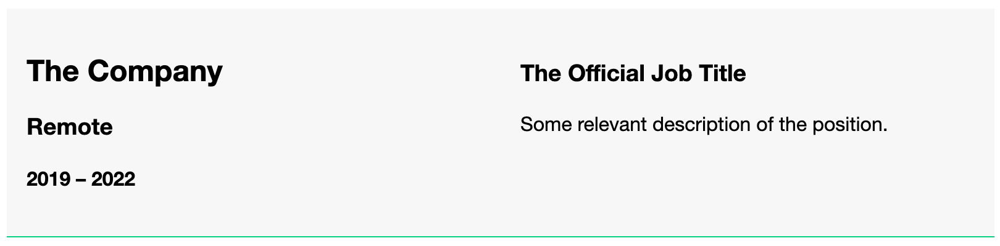
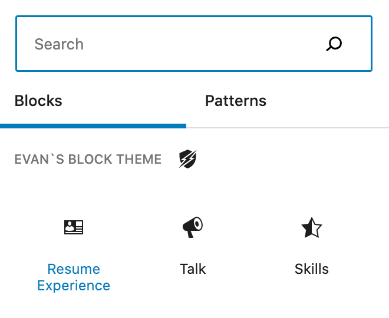

## Resume Experience Block
An important part of many personal sites is an online resume. I know many have made career advancements thanks to their personal site. 

This are custom blocks as a variation on columns block. They have some preset values and layout, but didn't require a full on custom block. The danger of using a block variation is that the block could be changed (unless you lock it).

### Block description
This block appears to be a full on block, but it's only a [block variation](https://github.com/circlecube/evans-block-theme/blob/main/block-variations/resume-experience.js) of a column block. It has preset some innerblocks to keep formatting consistent. There are also some custom [styles](https://github.com/circlecube/evans-block-theme/blob/main/block-variations/_resume-experience.scss) in place.



# Block Inserter


### Block markup
```
<!-- wp:columns {"verticalAlignment":"top","className":"resume-experience-block"} -->
<div class="wp-block-columns are-vertically-aligned-top resume-experience-block"><!-- wp:column {"verticalAlignment":"top","width":"50%"} -->
<div class="wp-block-column is-vertically-aligned-top" style="flex-basis:50%"><!-- wp:heading {"placeholder":"Company","className":"job-company"} -->
<h2 class="job-company">The Company</h2>
<!-- /wp:heading -->

<!-- wp:heading {"level":3,"placeholder":"Location","className":"job-location"} -->
<h3 class="job-location">Remote</h3>
<!-- /wp:heading -->

<!-- wp:heading {"level":4,"placeholder":"From – To","className":"job-dates"} -->
<h4 class="job-dates">2019 - 2022</h4>
<!-- /wp:heading --></div>
<!-- /wp:column -->

<!-- wp:column {"verticalAlignment":"top","width":"50%"} -->
<div class="wp-block-column is-vertically-aligned-top" style="flex-basis:50%"><!-- wp:heading {"level":3,"placeholder":"Job Title","className":"job-title"} -->
<h3 class="job-title">The Official Job Title</h3>
<!-- /wp:heading -->

<!-- wp:paragraph {"placeholder":"Job Description","className":"job-description"} -->
<p class="job-description">Some relevant description of the position.</p>
<!-- /wp:paragraph --></div>
<!-- /wp:column --></div>
<!-- /wp:columns -->
```

### Block example
View an example with other [blocks](https://evanmullins.com/blocks/#experience).

### Contents
- [Overview](overview.md)
- [The Case For A Personal Site](case-for-personal-site.md)
- [Helpful Blocks For A Personal Site](helpful-blocks.md)
 - [Business Card](business-card-block.md)
 - [Cover](cover-block.md)
 - [LinkTree](linktree-block.md)
 - [Social Links](social-links-block.md)
 - ***Resume Experience***
 - [Resume Skills](resume-skills-block.md)
 - [Talk](talk-block.md)
- [Get Inspired](insipration.md)
- [Thanks!](thanks.md)