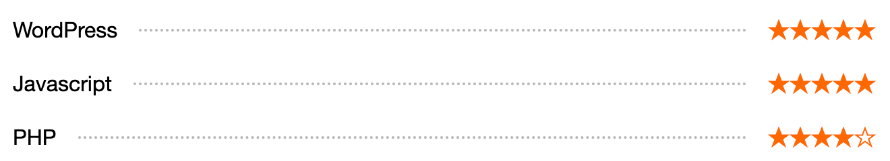

## Resume Skill Block
A custom block that lists skills and a star rating for each skill. This could be useful if you want a visual on a resume for example.

### Block description
View the block source code in the theme at [evans-block-theme/blocks/skills](https://github.com/circlecube/evans-block-theme/tree/main/blocks/skills) and [evans-block-theme/blocks/skill](https://github.com/circlecube/evans-block-theme/tree/main/blocks/skill). Notice that there is a skills block as well as a skill block. The skills contains skills (so you can list as many as you would like). The skills is just a container, and each individual skill has only a label and a level. You enter a label and select from a dropdown how many stars you equate to that skill. 



### Block markup
```
<!-- wp:evans-block-theme/skills {"label":"Here's a skill","level":"stars here"} -->
<div class="wp-block-evans-block-theme-skills"><!-- wp:evans-block-theme/skill {"label":"WordPress","level":"5"} /-->

<!-- wp:evans-block-theme/skill {"label":"Javascript","level":"5"} /-->

<!-- wp:evans-block-theme/skill {"label":"PHP","level":"4"} /--></div>
<!-- /wp:evans-block-theme/skills -->
```

### Block example
View an example with other [blocks](https://evanmullins.com/blocks/#skills).

### Contents
- [Overview](overview.md)
- [The Case For A Personal Site](case-for-personal-site.md)
- [Helpful Blocks For A Personal Site](helpful-blocks.md)
 - [Cover](cover-block.md)
 - [Business Card](business-card-block.md)
 - [LinkTree](linktree-block.md)
 - [Social Links](social-links-block.md)
 - [Resume Experience](resume-experience-job-block.md)
 - ***Resume Skills***
 - [Talk](talk-block.md)
- [Get Inspired](insipration.md)
- [Thanks!](thanks.md)