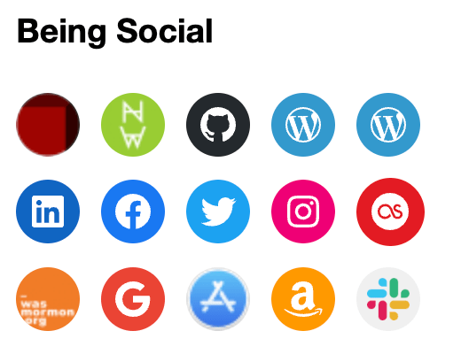

## Social Links Block
The core social block is a handy way to include a lot of links to other social networks. This is great for a personal site if you want visitors to be able to find you elsewhere online. 

When linking to a site with no built-in icon we can add one. Add custom classes to the links and then add css styles for custom background images to keep the link styles nice, recognizable and consistent. Here's an [example of the css rule](https://github.com/circlecube/evans-block-theme/blob/main/src/_footer.scss#L40).

### Block description
This is included as a template part so it is easy to drop in anywhere. The template part includes only a social links block with a slew of social links added. Note that it is also included in the site footer as a template part.



### Block markup
Template part block include markup
```
<!-- wp:template-part {"slug":"social","theme":"evans-block-theme"} /-->
```

Actual Social Template Part Markup
```
<!-- wp:social-links {"openInNewTab":true,"layout":{"type":"flex","justifyContent":"left","orientation":"horizontal"}} -->
<ul class="wp-block-social-links"><!-- wp:social-link {"url":"https://circlecube.com","service":"user","label":"circlecube.com","className":"custom circlecube"} /-->

<!-- wp:social-link {"url":"https://nomaderwhere.com","service":"chain","label":"nomaderwhere.com","className":"custom nomaderwhere"} /-->

<!-- wp:social-link {"url":"https://github.com/circlecube","service":"github","label":"github"} /-->

<!-- wp:social-link {"url":"https://profiles.wordpress.org/users/circlecube/","service":"wordpress","label":"WordPress"} /-->

<!-- wp:social-link {"url":"https://wordpress.tv/speakers/evan-mullins/","service":"wordpress","label":"WordPress.tv","className":"customer speaker"} /-->

<!-- wp:social-link {"url":"https://linkedin.com/in/evanmullins","service":"linkedin","label":"LinkedIn"} /-->

<!-- wp:social-link {"url":"https://facebook.com/evan.mullins","service":"facebook"} /-->

<!-- wp:social-link {"url":"https://twitter.com/circlecube","service":"twitter","label":"@circlecube"} /-->

<!-- wp:social-link {"url":"https://www.instagram.com/the.mullins.family.dad/","service":"instagram","label":"nomaderwhere_dad"} /-->

<!-- wp:social-link {"url":"https://last.fm/user/circlecube","service":"lastfm","label":"Last.fm"} /-->

<!-- wp:social-link {"url":"https://wasmormon.org/profile/evan.mullins","service":"chain","label":"wasmormon.org","className":"custom wasmormon"} /-->

<!-- wp:social-link {"url":"https://play.google.com/store/apps/developer?id=Evan+Mullins","service":"google","label":"Google Play App Store"} /-->

<!-- wp:social-link {"url":"https://itunes.apple.com/us/artist/evan-mullins/id971859233","service":"chain","label":"iTunes App Store","className":"custom itunes"} /-->

<!-- wp:social-link {"url":"https://www.amazon.com/s?rh=n%3A2350149011%2Cp_4%3AEvan+Mullins\u0026_encoding=UTF8\u0026ref=bl_sr_mobile-apps","service":"amazon","label":"Amazon App Store"} /-->

<!-- wp:social-link {"url":"https://app.slack.com/client/T024MFP4J/D1KM6HX8W/user_profile/U02S4LRKA","service":"slack","label":"making wordpress slack","className":"custom slack"} /--></ul>
<!-- /wp:social-links -->
```

### Block example
View an example with other [blocks](https://evanmullins.com/blocks/#social) or view it in my site footer. Learn all about the [social icons block](https://wordpress.org/support/article/social-icons/) in the docs.

### Contents
- [Overview](overview.md)
- [The Case For A Personal Site](case-for-personal-site.md)
- [Helpful Blocks For A Personal Site](helpful-blocks.md)
 - [Business Card](business-card-block.md)
 - [Cover](cover-block.md)
 - [LinkTree](linktree-block.md)
 - ***Social Links***
 - [Resume Experience](resume-experience-job-block.md)
 - [Resume Skills](resume-skills-block.md)
 - [Talk](talk-block.md)
- [Get Inspired](insipration.md)
- [Thanks!](thanks.md)