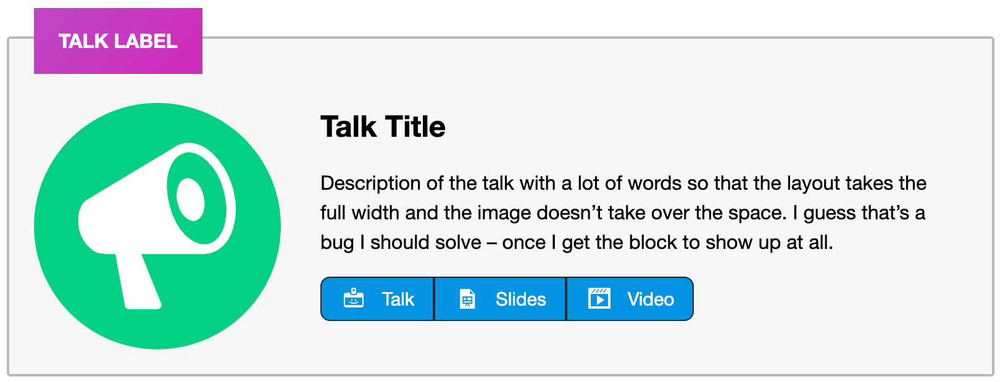
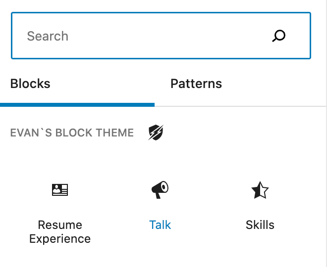

## Talk Block
A custom block (built into the theme) to display a talk with details and format links to the talk, slides and video. If you enjoy speaking or teaching at conferences or meetups, you can easily list them on your personal site.

Before blocks, I listed speaking engagements on my site and was tired of messing with the formatting over time, so I figured I could make a custom block to take care of all the formatting and make it easy to maintain and keep the content organized and elegant. 


### Block description
View the block source code in the theme at [evans-block-theme/blocks/talk](https://github.com/circlecube/evans-block-theme/tree/main/blocks/talk).



### Block markup
```
<!-- wp:evans-block-theme/talk {"label":"Talk Label","headline":"Talk Title","description":"Description of the talk with a lot of words so that the layout takes the full width and the image doesn't take over the space. I guess that's a bug I should solve - once I get the block to show up at all.","talk_link":{"title":"Talk","url":"https://google.com/talk"},"slide_link":{"title":"Slides","url":"Https://google.com/slides"},"video_link":{"title":"Video","url":"https://google.com/video"}} /-->
```

# Block Inserter


### Block example
View this block in action on the [speaking](https://evanmullins.com/speaking/) page.
Also, view an example with other [blocks](https://evanmullins.com/blocks/#talk).

### Contents
- [Overview](overview.md)
- [The Case For A Personal Site](case-for-personal-site.md)
- [Helpful Blocks For A Personal Site](helpful-blocks.md)
 - [Business Card](business-card-block.md)
 - [Cover](cover-block.md)
 - [LinkTree](linktree-block.md)
 - [Social Links](social-links-block.md)
 - [Resume Experience](resume-experience-job-block.md)
 - [Resume Skills](resume-skills-block.md)
 - ***Talk***
- [Get Inspired](insipration.md)
- [Thanks!](thanks.md)