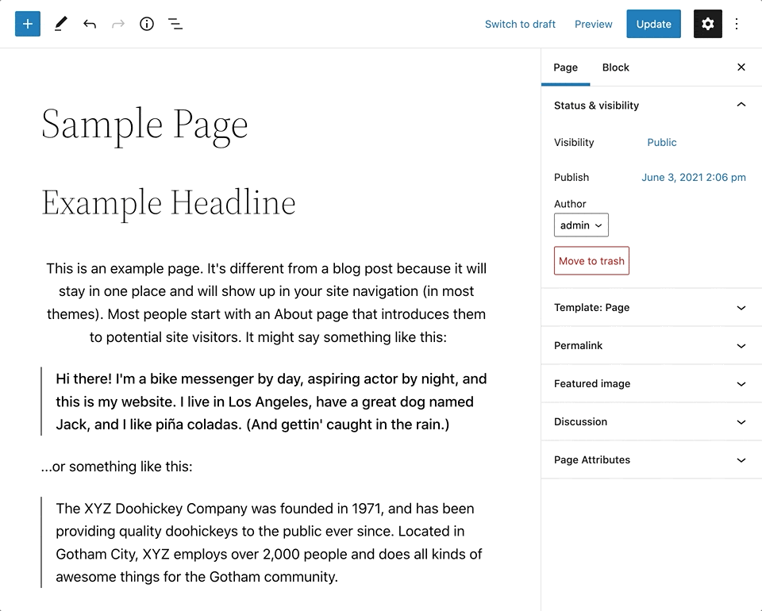

# Block Markup

## Grammar and Syntax

Blocks are saved as actual HTML comments with attributes and settings in a json format. This allows the content to be valid html but still contain all the flexible rich metadata the editor consumes to make it all interactive in editor and also on the front end.

The editor is essentially a javascript app, it consumes the post content and constructs an editor view. The content is stored as blocks with a new WordPress specific block markup. This markup is referred to as block grammar, it’s valid html with all the attributes and settings saved in a serialized html comment format.

Distilled, the block grammar is an HTML comment, either a self-closing tag or with a beginning tag and ending tag. In the main tag, depending on the block type and user customizations, there can be a JSON object. This raw form of the block is referred to as serialized.

```
<!-- wp:paragraph {"key": "value"} -->
<p>Welcome to the world of blocks.</p>
<!-- /wp:paragraph →
```

Blocks can be static or dynamic. Static blocks contain rendered content and an object of Attributes used to re-render based on changes. Dynamic blocks require server-side data and rendering while the post content is being generated (rendering).

Each block contains Attributes or configuration settings, which can be sourced from raw HTML in the content via meta or other customizable origins.



Go view the markup for all your blocks, it may help you see blocks a little differently. Just click the three dots on any gutenberg page and select the code editor. You can see the html content as well as the block attributes in the html comments.

Notice that the attributes are saved as well as the results of these attributes: heading level and alignment values are saved as attributes and the h3 element and the alignment class in the element.

### Further reading
- https://developer.wordpress.org/block-editor/explanations/architecture/key-concepts/


### Contents
- [Overview](01-overview.md)
- [Block Vision](02-block-vision.md)
- [Block Basics](03-block-basics.md)
- ***Block Markup***
- [Core Blocks](05-core-blocks.md)
- [Custom Blocks](06-custom-blocks.md)
- [Dynamic Blocks](07-dynamic-blocks.md)
- [Block Styles](08-block-styles.md)
- [Reusable Blocks](09-reusable-blocks.md)
- [InnerBlocks](10-innerblocks.md)
- [Block Variations](11-block-variations.md)
- [Block Transforms](12-block-transforms.md)
- [Block Supports](13-block-supports.md)
- [Widget Blocks](14-widget-blocks.md)
- [Block Patterns](15-block-patterns.md)
- [Block Template](16-block-template.md)
- [Block-Based Themes](17-block-based-themes.md)
- [Block Templates](18-block-templates.md)
- [Block Template Parts](19-block-template-parts.md)
- [Blocks Deeply](20-blocks-deeply.md)