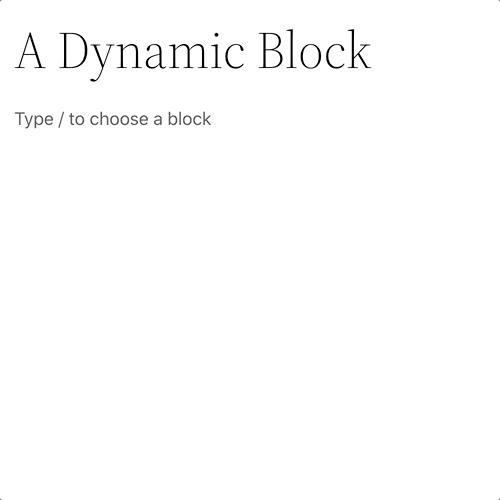

# Dynamic Blocks

Dynamic blocks connect to the database to compute and render content whereas a static block has content that doesn’t change. For example, a latest posts block has dynamic content that changes. Notice the latest posts block shows a loader only while it fetches the dynamic content.

These include anything that is non-static block, a dynamic block must connect to the database to compute and render content. A static block is only static content that doesn’t change, like a paragraph block with simple text as the content. A dynamic block is something that changes based on the data and options, such as a recent posts block. They need interaction with the server so either by using ServerSideRendering or api interactions to collect data.

These could be coming from the rest api on the current site or even another site or service. The key is that the content isn’t actually (usually) stored in the database, the block is saved with settings and attributes and then reaches out usually server side to gather the data and render the content.

### Further Reading
- https://developer.wordpress.org/block-editor/how-to-guides/block-tutorial/creating-dynamic-blocks/  
### Contents
- [Overview](01-overview.md)
- [Block Vision](02-block-vision.md)
- [Block Basics](03-block-basics.md)
- [Block Markup](04-block-markup.md)
- [Core Blocks](05-core-blocks.md)
- [Custom Blocks](06-custom-blocks.md)
- ***Dynamic Blocks***
- [Block Styles](08-block-styles.md)
- [Reusable Blocks](09-reusable-blocks.md)
- [InnerBlocks](10-innerblocks.md)
- [Block Variations](11-block-variations.md)
- [Block Transforms](12-block-transforms.md)
- [Block Supports](13-block-supports.md)
- [Widget Blocks](14-widget-blocks.md)
- [Block Patterns](15-block-patterns.md)
- [Block Template](16-block-template.md)
- [Block-Based Themes](17-block-based-themes.md)
- [Block Templates](18-block-templates.md)
- [Block Template Parts](19-block-template-parts.md)
- [Blocks Deeply](20-blocks-deeply.md)