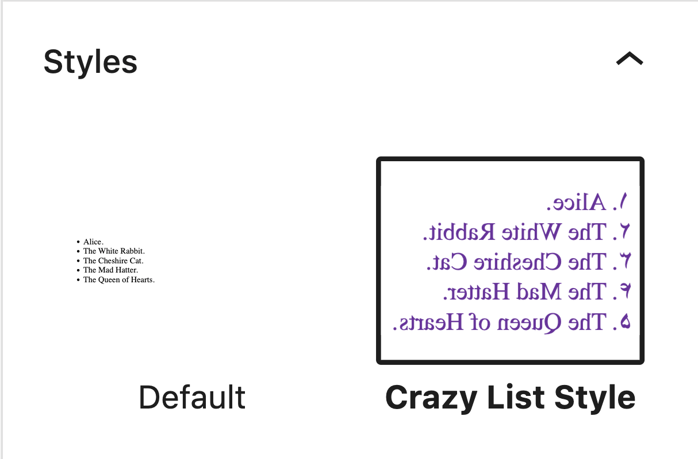

# Block Styles

To customize styles via a class name

Block styles are alternative styles to be applied to existing blocks. We can add a new block style to any block. Block styles work by adding a class (className) to the block’s wrapper. This className is then user to provide styling for the block when the block style is selected.

Sometimes a developing a new block isn’t necessary and you can get away with just adding some custom styles to an existing block. These styles can be set as the default styling, but more commonly they are as a new style users can then choose in the inspector. 

## Example
In this example we see the list block has a crazy list style applied which makes the list purple, flips it backwards, etc.

```
// adds .is-style-crazy-list class to list element
// it's up to you to add those styles to a css rule
register_block_style(
    'core/list',
    array(
        'name'  => 'crazy-list',
        'label' => 'Crazy List Style'
    )
);
```



### Further Reading
- https://developer.wordpress.org/block-editor/reference-guides/block-api/block-styles/ 
- https://developer.wordpress.org/block-editor/explanations/architecture/styles/
### Contents
- [Overview](01-overview.md)
- [Block Vision](02-block-vision.md)
- [Block Basics](03-block-basics.md)
- [Block Markup](04-block-markup.md)
- [Core Blocks](05-core-blocks.md)
- [Custom Blocks](06-custom-blocks.md)
- [Dynamic Blocks](07-dynamic-blocks.md)
- ***Block Styles***
- [Reusable Blocks](09-reusable-blocks.md)
- [InnerBlocks](10-innerblocks.md)
- [Block Variations](11-block-variations.md)
- [Block Transforms](12-block-transforms.md)
- [Block Supports](13-block-supports.md)
- [Widget Blocks](14-widget-blocks.md)
- [Block Patterns](15-block-paterns.md)
- [Block Template](16-block-template.md)
- [Block-Based Themes](17-block-based-themes.md)
- [Block Templates](18-block-templates.md)
- [Block Template Parts](19-block-template-parts.md)
- [Blocks Deeply](20-blocks-deeply.md)