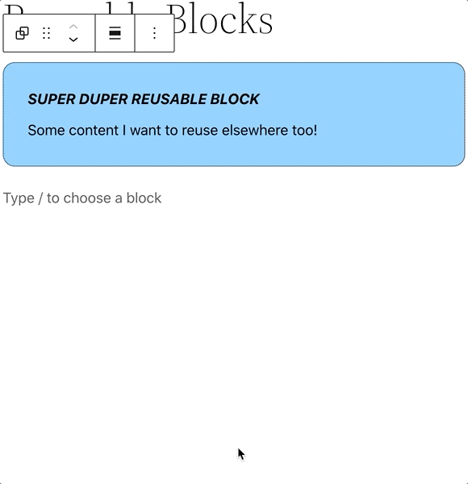

# Reusable Blocks

We can save a block (or group of blocks) to be used in multiple placed on a site. 

Reusable blocks are blocks with identical contents that are used in multiple places on a site. This is an end-user feature (rather than developer focused). For example, if you have a blurb at the end of every blog post, you can include it and manage the content globally from one place. If you make an edit to a reusable block, the edits will affect every instance of that block.

### Further Reading
- https://wordpress.com/support/wordpress-editor/blocks/reusable-block/ 

### Contents
- [Overview](01-overview.md)
- [Block Vision](02-block-vision.md)
- [Block Basics](03-block-basics.md)
- [Block Markup](04-block-markup.md)
- [Core Blocks](05-core-blocks.md)
- [Custom Blocks](06-custom-blocks.md)
- [Dynamic Blocks](07-dynamic-blocks.md)
- [Block Styles](08-block-styles.md)
- ***Reusable Blocks***
- [InnerBlocks](10-innerblocks.md)
- [Block Variations](11-block-variations.md)
- [Block Transforms](12-block-transforms.md)
- [Block Supports](13-block-supports.md)
- [Widget Blocks](14-widget-blocks.md)
- [Block Patterns](15-block-patterns.md)
- [Block Template](16-block-template.md)
- [Block-Based Themes](17-block-based-themes.md)
- [Block Templates](18-block-templates.md)
- [Block Template Parts](19-block-template-parts.md)
- [Blocks Deeply](20-blocks-deeply.md)