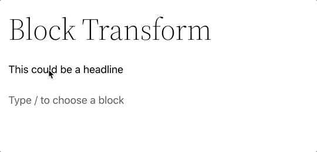

# Block Transforms

Block Transforms is the API that allows a block to be transformed from and to other blocks. All blocks can define what blocks they can transform into via the block controls. The benefit to this is the content and some attributes can be mapped to the content and attributes of the new block type.

For example, we can transform or change a paragraph block into a heading block and keep the content and some other options in the process.

### Further Reading
- https://developer.wordpress.org/block-editor/reference-guides/block-api/block-transforms/ 

### Contents
- [Overview](01-overview.md)
- [Block Vision](02-block-vision.md)
- [Block Basics](03-block-basics.md)
- [Block Markup](04-block-markup.md)
- [Core Blocks](05-core-blocks.md)
- [Custom Blocks](06-custom-blocks.md)
- [Dynamic Blocks](07-dynamic-blocks.md)
- [Block Styles](08-block-styles.md)
- [Reusable Blocks](09-reusable-blocks.md)
- [InnerBlocks](10-innerblocks.md)
- [Block Variations](11-block-variations.md)
- ***Block Transforms***
- [Block Supports](13-block-supports.md)
- [Widget Blocks](14-widget-blocks.md)
- [Block Patterns](15-block-paterns.md)
- [Block Template](16-block-template.md)
- [Block-Based Themes](17-block-based-themes.md)
- [Block Templates](18-block-templates.md)
- [Block Template Parts](19-block-template-parts.md)
- [Blocks Deeply](20-blocks-deeply.md)