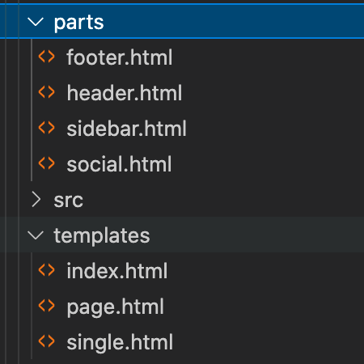

# Block Template Parts

Template parts are used to organize a theme in smaller reusable structural parts. They are commonly used for a global site header and site footer for example.

Both templates and template parts contain block markup to represent blocks and block settings and content. Template are located in a `templates` directory in the theme and template parts are located in a `parts` directory.

### Further Reading
- https://developer.wordpress.org/themes/block-themes/templates-and-template-parts/
### Contents
- [Overview](01-overview.md)
- [Block Vision](02-block-vision.md)
- [Block Basics](03-block-basics.md)
- [Block Markup](04-block-markup.md)
- [Core Blocks](05-core-blocks.md)
- [Custom Blocks](06-custom-blocks.md)
- [Dynamic Blocks](07-dynamic-blocks.md)
- [Block Styles](08-block-styles.md)
- [Reusable Blocks](09-reusable-blocks.md)
- [InnerBlocks](10-innerblocks.md)
- [Block Variations](11-block-variations.md)
- [Block Transforms](12-block-transforms.md)
- [Block Supports](13-block-supports.md)
- [Widget Blocks](14-widget-blocks.md)
- [Block Patterns](15-block-paterns.md)
- [Block Template](16-block-template.md)
- [Block-Based Themes](17-block-based-themes.md)
- [Block Templates](18-block-templates.md)
- ***Block Template Parts***
- [Blocks Deeply](20-blocks-deeply.md)